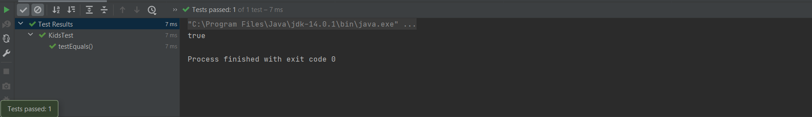
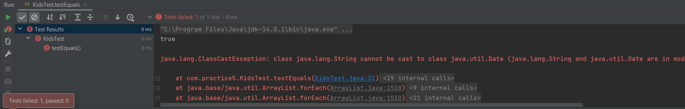

# [Java]单元测试类

IDEA中：ctrl + shift + T -> 勾选想要测试的属性和方法

Eclipse中：选中当前工程 -> 右键选择 build path -> add libraries -> JUnit4 -> 下一步


### 对JUnitTest类的要求

1. 此类是public的
2. 此类提供公共的无参构造器


### JUnitTest类中声明单元测试的方法

- 此时的单元测试方法：方法的权限是public，没有返回值，没有形参

- 需要声明注解@Test，并在单元测试类中导入import org.junit.Test

  ```java
  @Test
  public void testEquals() {
      String s1 = "MM";
      String s2 = "MM";
      System.out.println(s1.equals(s2));
  }
  ```

- 运行测试：右键

  

  - pass 

    

  - 执行结果出现异常

    