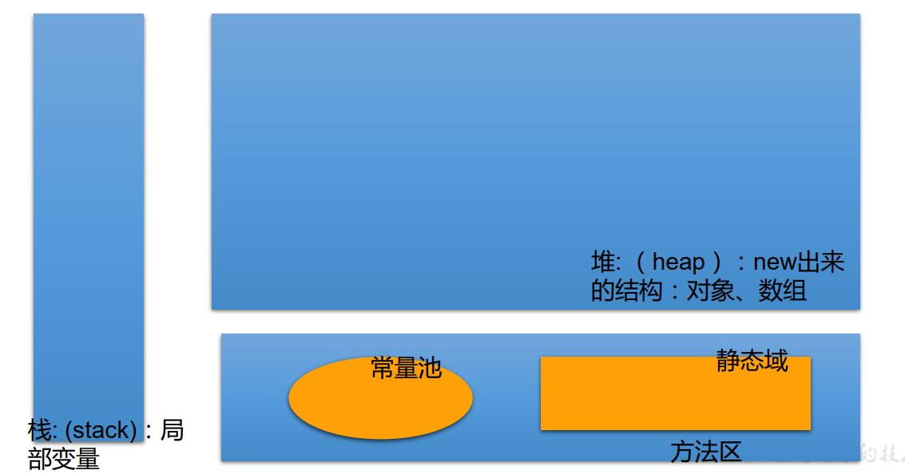
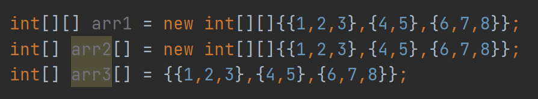

[TOC]

# 数组 Array

### 概述  

数组(Array)， 是多个<u>相同类型数据</u>按<u>一定顺序排列</u>的集合， 并使用<u>一个名字命名</u>， 并通过<u>编号</u>的方式对这些数据进行统一管理。  

数组本身是引用数据类型， 而数组中的元素可以是任何数据类型， 包括基本数据类型和引用数据类型。  

创建数组对象会在内存中开辟一整块连续的空间， 而数组名中引用的是这块连续空间的首地址。  

数组的长度一旦确定， 就不能修改。  

我们可以直接通过下标(或索引)的方式调用指定位置的元素， 速度很快。  

##### 数组的分类：  

- 按照维度：一维数组、 二维数组、 三维数组、 …
- 按照元素的数据类型分：基本数据类型元素的数组、 引用数据类型元素的数组(即对象数组)  


### 数组的使用

##### 声明

```type var[]``` 或  ```type[] var  ```

```java
int a[];
int[] a1;
String[] c; //引用类型变量数组
```

注意：Java语言中声明数组时不能指定其长度(数组中元素的数)， 例如： ```int a[5]; //非法  ```

##### 初始化

- 动态初始化 - 数组声明且为数组元素分配空间与赋值的操作分开进行 。

  ```java
  int[] arr = new int[3];
  arr[0] = 3;
  arr[1] = 9;
  arr[2] = 8;
  ```

- 静态初始化：  在定义数组的同时就为数组元素分配空间并赋值。

  ```java
  int arr[] = new int[]{3,9,8};
  int arr[] = {3,9,8};
  String names[] = {"MoQi", "MoYuan", "MoYu"};
  int[] arr = {1,2,3,4,5}; // 类型推断 - 前面已经声明了是int类型的array，后面也不可能是其他类型了，可以省略new int[]
  ```

### 数组元素的引用  

定义并用运算符`new`为之分配空间后，才可以引用数组中的每个元素；  

数组的索引从0开始，到数组长度-1结束

数组元素的引用方式：数组名[数组元素下标]  

- 数组元素下标可以是整型常量或整型表达式。如a[3] , b[i] , c[6*i];  
- 数组元素下标从0开始；长度为n的数组合法下标取值范围: 0 —>n-1； 如int a[]=new int[3]; 可引用的数组元素为a[0]、 a[1]、 a[2] 

### 数组长度

每个数组都有一个属性length指明它的长度，例如： a.length 指明数组a的长度(元素个数)  

- 数组一旦初始化，其长度是不可变的 

### 数组元素的默认初始化值

| 数据类型                    | 默认初始化值     |
| --------------------------- | ---------------- |
| byte, short, int, long      | 0                |
| float, double               | 0.0              |
| char                        | ASCII = 0 的字符 |
| boolean                     | false            |
| 引用数据类型: String, Array | null             |

### 数组的内存解析




### 二维数组

##### 声明和初始化

- 静态初始化

  

  

- 动态初始化

  ```java
  String[][] arr = new String[2][3];// 2 - row, 3 - col
  ```

  ```java
  String[][] arr = new String[2][];
  ```


### 数组中的 ++

- `i++`, 先赋值再加

  ```java
  int[] arr = new int[]{0,1,2,3,4,5};
  int i=0;
  while (i<arr.length-1){
  	System.out.println(arr[i++]);
  }
  // 0 1 2 3 4
  
  while (i<arr.length-1){
  	System.out.println(arr[++i]);
  }
  // 1 2 3 4 5
  ```


### Arrays工具类的使用

`java.util.Arrays`类即为操作数组的工具类。

| 方法                                  | 作用                                                         |
| ------------------------------------- | ------------------------------------------------------------ |
| `boolean equals(int[] a, int[] b)`    | 判断两个数组是否相等(是否指向同一地址 或 是否含有完全相同的元素) |
| `String toString(int[] a)`            | 输出数组信息                                                 |
| `void fill(int[] a, int val)`         | 将指定值填充到数组中(将原数组中的每个元素都替换为`val`)      |
| `void binarySearch(int[] a, int key)` | 对排序后的数组进行二分法检索指定的值                         |

