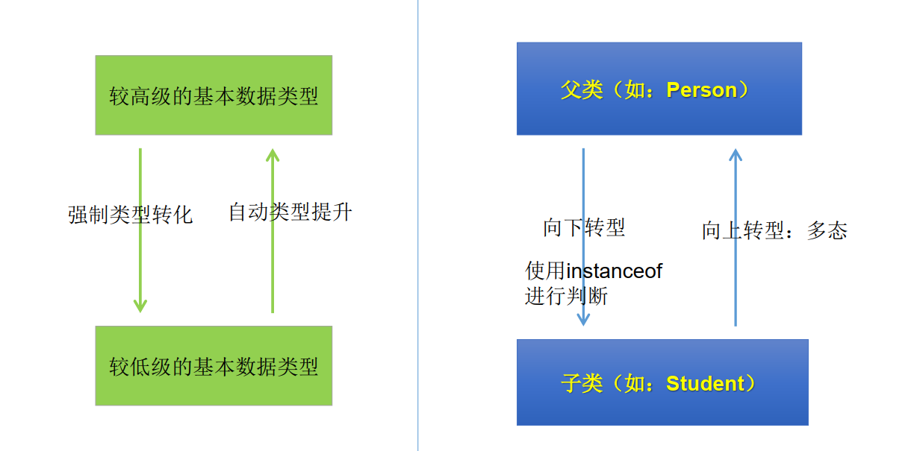

# [java]casting对象类型转换

### 基本数据类型的Casting

- 自动类型转换：小的数据类型可以自动转换为大的数据类型

  ```java
  long g = 20;
  double d = 12f;
  ```

- 强制类型转换：可以吧大的数据类型强制转换（casting）成小的数据类型

  ```java
  float f = (float)12.0;
  int a = (int) 1200L;
  ```

### Java对象造型

对Java对象的强制类型转换称为**造型**

- 从子类到父类的类型转换可以自动进行
- 从父类到子类的类型转换必须通过造型（强制类型转换）实现
- 无继承关系的引用类型剑的转换是非法的
- 在造型前可以使用instanceof操作符测试一个对象的类型

```java
public class ConversionTest {
    public static void main(String[] args) {
        double d = 13.4;
        long l = (long) d;
        System.out.println(l);
        int in = 5;
        // boolean b = (boolean)in;
        Object obj = "Hello";
        String objStr = (String) obj;
        System.out.println(objStr);
        Object objPri = new Integer(5);
        // 所以下面代码运行时引发ClassCastException异常
        String str = (String) objPri;
    }
}

public class Test {
    public void method(Person e) { // 设Person类中没有getschool() 方法
        // System.out.pritnln(e.getschool()); //非法,编译时错误
        if (e instanceof Student) {
            Student me = (Student) e; // 将e强制转换为Student类型
            System.out.pritnln(me.getschool());
        }
}
    
    public static void main(String[] args){
        Test t = new Test();
        Student m = new Student();
        t.method(m);
    }
}
```



### 例

- 编译时通过，运行时不通过

  ```java
  Person p = new Woman();
  Man m = (Man) p;
  ```

  ```java
  Person p = new Person();
  Man m = (Man) p; // p必须声明为Man类型的，才能强制转换为Man类型
  ```

- 编译通过，运行也通过

  ```java
  Object obj = new Woman();
  Person p = (Person) obj;
  ```

- 编译不通过

  ```java
  Man m = new Woman(); // Type does not match
  ```

  