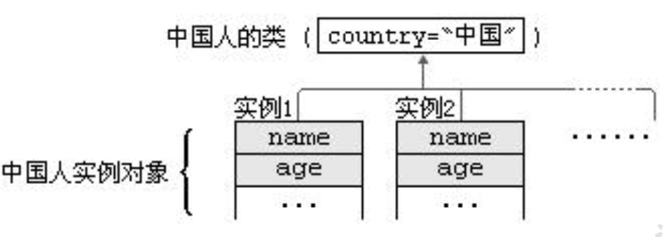
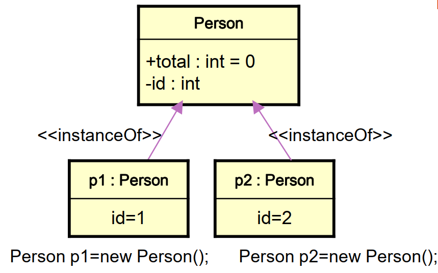
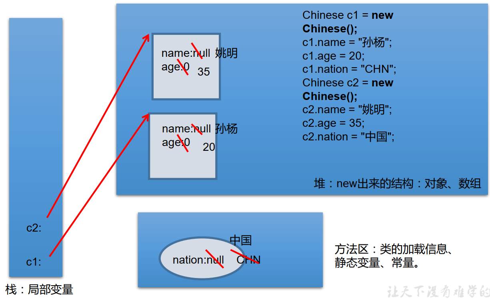

# [java]static

当我们编写一个类时，其实就是在描述其对象的属性和行为，而并没有产生实质上的对象，只有通过new关键字才会产生出对象，这时系统才会分配内存空间给对象，其方法才可以供外部调用。我们有时候希望无论是否产生了对象或无论产生了多少对象的情况下， 某些特定的数据在内存空间里只有一份，例如所有的中国人都有个国家名称，每一个中国人都共享这个国家名称，不必在每一个中国人的实例对象中都单独分配一个用于代表国家名称的变量。  



- 如果想让一个类的所有实例共享数据，就用类变量！  

### 类属性、类方法的设计思想  

类属性作为该类各个对象之间共享的变量。 在设计类时,分析哪些属性不因对象的不同而改变，将这些属性设置为类属性。相应的方法设置为类方法。  

如果方法与调用者无关，则这样的方法通常被声明为类方法，由于不需要创建对象就可以调用类方法，从而简化了方法的调用。  


### 关键字: static

- 使用范围
  - 在Java类中， 可用static修饰属性、 方法、 代码块、 内部类  
- 被修饰后的成员具备以下特点：  
  - 随着类的加载而加载  
  - 优先于对象存在  
  - 修饰的成员，被所有对象所共享  
  - 访问权限允许时，可不创建对象，直接被类调用

### 例

```java
class Circle {
    private double radius;
    public static String name = "这是一个圆";
    public static String getName() {
        return name;
    }
    public Circle(double radius) {
        this.radius = radius;
    }
    public double findArea() {
        return Math.PI * radius * radius;
    }
    public void display() {
        System.out.println("name:" + name + "radius:" + radius);
    }
}

public class StaticTest {
    public static void main(String[] args) {
        Circle c1 = new Circle(2.0);
        Circle c2 = new Circle(3.0);
        c1.display();
        c2.display();
    }
}
```


### 类变量(class Variable)  

类变量（类属性）由该类的所有实例共享。

- 类的加载早于对象
- 静态变量（类变量）随着类的加载而加载
- 静态变量的加载早于对象的创建
- 由于类只会加载一次，则静态变量在内存中也只会存在一份：存在于方法区的静态域中。

静态属性举例

- `System.out`
- `Math.PI`



```java
public class Person {
    
    private int id;
    public static int total = 0;
    
    public Person() {
        total++;
        id = total;
    }
}

public class StaticDemo {
    public static void main(String args[]) {
        Person.total = 100; // 不用创建对象就可以访问静态成员
        //访问方式：类名.类属性， 类名.类方法
        System.out.println(Person.total);
        Person c = new Person();
        System.out.println(c.total); //输出101
    }
}
```


### 类变量 vs 实例变量内存解析  




### 类方法(class method)  

- 没有对象的实例时，可以用类名.方法名()的形式访问由static修饰的类方法。  
- 在static方法内部只能访问类的static修饰的属性或方法， 不能访问类的非static的结构。  
  - 静态方法中，只能调用静态方法或属性
  - 非静态方法中，既可以调用非静态方法或属性，也可以调用非静态方法或属性
  - 取决于他们的生命周期

```java
class Person {
    private int id;
    private static int total = 0;
    public static int getTotalPerson() {
        //id++; //非法
        return total;}
    public Person() {
        total++;
        id = total;
    }
}

public class PersonTest {
    public static void main(String[] args) {
        System.out.println("Number of total is " + Person.getTotalPerson()); //0
        //没有创建对象也可以访问静态方法
        Person p1 = new Person();
        System.out.println( "Number of total is "+ Person.getTotalPerson()); //1
    }
}
```

- 因为不需要实例就可以访问static方法，因此static方法内部不能有this。 (也不能有super ? YES!)  
- static修饰的方法不能被重写  

```java
class Person {
    private int id;
    private static int total = 0;
    public static void setTotalPerson(int total){
        this.total=total; //非法，在static方法中不能有this，也不能有super
    }
    
    public Person() {
        total++;
        id = total;
    }
}
public class PersonTest {
    public static void main(String[] args) {
        Person.setTotalPerson(3);
    }
}
```


### 开发中

##### 开发中，如何确定一个属性时否要声明为static的？

- 属性时可以被多个对象所共享的，不会随着对象的不同而不同的。
- 类中的常量也常声明为static，常量就是对所有对象都一样的值，不会变，比如`Math.PI`

##### 开发中，如何确定一个方法是否要声明为static的？

- 操作静态属性的方法，通常设置为static的
- 工具类中的方法，习惯上声明为static的。比如：`Math` `Arrays` `Collections`

