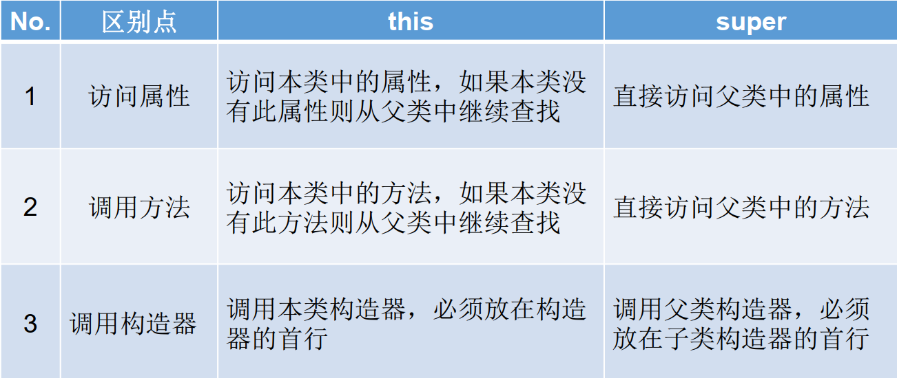

# [java]super

- 在Java类中使用super来调用父类中的指定操作：
  - super可用于访问父类中定义的属性
  - super可用于调用父类中定义的成员方法
  - super可用于在子类构造器中调用父类的构造器
- 注意：
  - 尤其当父类出现同名成员时，可以用super表明调用的是父类中的成员
  - super的追溯不仅限于直接父类
  - super和this的用法相像，this代表本类对象的引用，super代表父类的内存空间的标识

### super的使用

- 在子类的方法或构造器中，通过使用“super.属性”或“super.方法”的方式，显式地调用父类中声明的属性或方法。但是，在通常情况下，我们习惯省略“super.”
- 特殊情况：当子类和父类中定义了同名的属性时，要想在子类中调用父类中声明的属性，则必须是显式的使用“super.属性”来调用父类中的属性。
- 特殊情况：当子类重复写了父类中的方法以后，我们想在子类的方法中调用父类中被重写的方法时，则必须是显式的使用“super.方法”来调用父类中的方法。

### 例

```java
class protected Person {
    String name = "张三"; 
    protected int age;
    public String getInfo() {
        return "Name: " + name + "\nage: " + age;
    }
}

class Student extends Person {
    protected String name = "李四";
    private String school = "New Oriental";
    
    public String getSchool() {
        return school;
    }
    public String getInfo() {
        return super.getInfo() + "\nschool: " + school; // super的使用
    }
}

public class StudentTest {
    public static void main(String[] args) {
        Student st = new Student();
        System.out.println(st.getInfo());
    }
}
```


### super使用构造器

- 子类中所有的构造器默认都会访问父类中空参数的构造器
- 当父类中没有空参数的构造器时，子类的构造器必须通过this(参数列表)或者super(参数列表)语句指定调用本类或者父类中相应的构造器。
- 可以在子类的构造器中显式地使用“super(形参列表)”的方式，调用父类中声明的指定的构造器。
- “super(形参列表)”的使用，必须声明在子类构造器的首行！
- 类的构造器中，针对于”this(形参列表)”或“super(形参列表)”只能二选一
- 在构造器的首行，没有显式地申明“this(形参列表)”或“super(形参列表)”，则默认调用的是父类中的空参构造器 super()
- 若子类构造器中既未显示调用父类或本类的构造器，且父类中又没有无参的构造器，则编译出错


### 例

```java
public private classString Person { 
    private String name; 
    private int age;
    private Date birthDate;
    
    public Person(String name, int age, Date d) {
        this.name = name;
        this.age = age;
        this.birthDate = d;
    }
    public Person(String name, int age) {
        this(name, age, null);
    }
    public Person(String name, Date d) {
        this(name, 30, d);
    }

    public Person(String name) {
        this(name, 30);
    }
}

public class Student extends Person {
    private String school;
    
    public Student(String name, int age, String s) {
        super(name, age);
        school = s;
    }
    
    public Student(String name, String s) {
        super(name);
        school = s;
    }
    
    // 编译出错: no super(),系统将调用父类无参数的构造器。
    public Student(String s) {
        school = s;
    }
}
```


### 子类对象实例化的全过程

1. 从结果上看（继承性）
   1. 子类继承父类以后，就获取了父类中声明的属性或方法
   2. 创建子类的对象，在堆空间中，就会加载所有父类中声明的属性
2. 从过程上来看
   1. 通过子类的构造器创建子类对象时，一定会直接或间接地调用其父类构造器，进而调用父类的父类的构造器。直到调用了java.lang.Object类中空参的构造器为止。正因为加载过所有父类的结构，所以才可以看到内存中有父类中的结构，子类对象才可以考虑进行调用。


### this & super 区别



