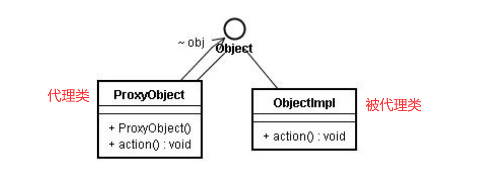

# [java]代理模式

### 概述

代理模式是Java开发中使用较多的一种设计模式。代理设计就是为其他对象提供一种代理以控制对这个对象的访问。




```java
public class NetworkTest {
    public static void main(String[] args) {
        Server server = new Server();
        ProxyServer proxyServer = new ProxyServer(server);
        proxyServer.browse();
    }
}


interface Network {
    public void browse();
}

// 被代理类
class Server implements Network{

    @Override
    public void browse() {
        System.out.println("The network has been connected");
    }
}

// 被代理类
class ProxyServer implements Network{

    private Network network;

    public ProxyServer(Network network){
        this.network = network;
    }

    public void check(){
        System.out.println("checking...");
    }

    @Override
    public void browse() {
        check();
        network.browse(); // 调用了Server中的browse()
    }
}
```


### 应用场景

- 安全代理：屏蔽对真实角色的直接访问。
- 远程代理：通过代理类处理远程方法调用（RMI）
- 延迟加载：先加载轻量级的代理对象，真正需要再加载真实对象。

比如你要开发一个大文档查看软件， 大文档中有大的图片， 有可能一个图片有100MB， 在打开文件时， 不可能将所有的图片都显示出来， 这样就可以使用代理模式， 当需要查看图片时， 用proxy来进行大图片的打开。  

### 分类

- 静态代理（静态定义代理类）
- 动态代理（动态生成代理类）
  - JDK自带的动态代理，需要反射等知识。