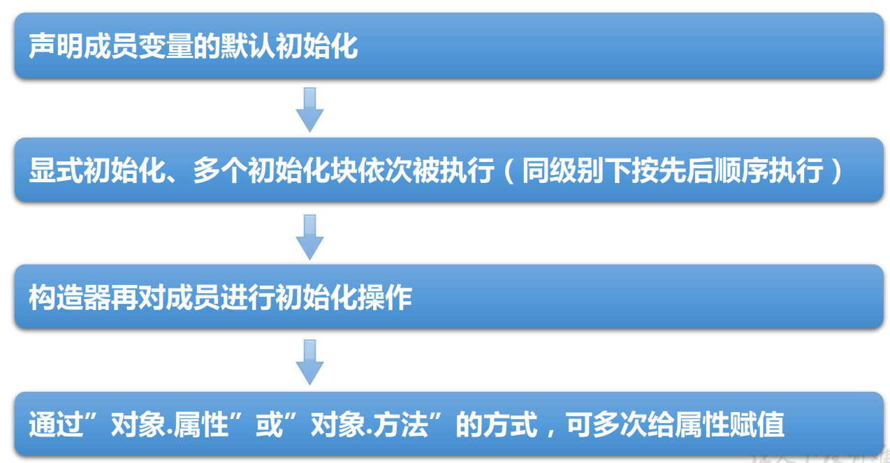

# [java]代码块

### 代码块(或初始化块)的作用

- 对Java类或对象进行初始化  

### 代码块(或初始化块)的分类

- 一个类中代码块若有修饰符， 则只能被static修饰， 称为静态代码块(static block)， 没有使用static修饰的， 为非静态代码块。

- static代码块通常用于初始化static的属性

  ```java
  class Person {
      public static int total;
      static {
          total = 100;//为total赋初值
      }
      …… //其它属性或方法声明
  }
  ```

  

### 静态代码块：用static 修饰的代码块

1. 内部可以有输出语句。
2. 可以对类的属性、类的声明进行初始化操作。
3. 不可以对非静态的属性初始化。即：不可以调用非静态的属性和方法。
4. 若有多个静态的代码块，那么按照从上到下的顺序依次执行。
5. 静态代码块的执行要先于非静态代码块。
6. 静态代码块随着类的加载而加载，且只执行一次。  

### 非静态代码块：没有static修饰的代码块

1. 内部可以有输出语句。
2. 可以对类的属性、 类的声明进行初始化操作。
3. 除了调用非静态的结构外， 还可以调用静态的变量或方法。
4. 若有多个非静态的代码块， 那么按照从上到下的顺序依次执行。
5. 每次创建对象的时候， 都会执行一次。 且先于构造器执行  

### 静态初始化块举例  

```java
class Person {
    public static int total;
    static {
        total = 100;
        System.out.println("in static block!");
    }
}

public class PersonTest {
    public static void main(String[] args) {
        System.out.println("total = " + Person.total);
        System.out.println("total = " + Person.total);
    }
}

/*
输出：
in static block
total=100
total=100
*/
```

### 总结：程序中成员变量赋值的执行顺序




1. 默认初始化

   - 各种基本数据类型的默认值

2. 显式初始化 / 在代码块中赋值

   - 二者并列，顺序执行

   ```java
   class Order{
   	// 显示初始化
       int orderId = 3;
       // 在代码块中赋值
       {
           orderId = 4;
       }
   }
   ```

3. 构造器中初始化

   ```java
   class Order{
       int orderId;
       
       public Order(int orderId){
           this.orderId = orderId
       }
   }
   ```

4. 有了对象以后，通过“对象.属性”或“对象.方法”的方式，进行赋值