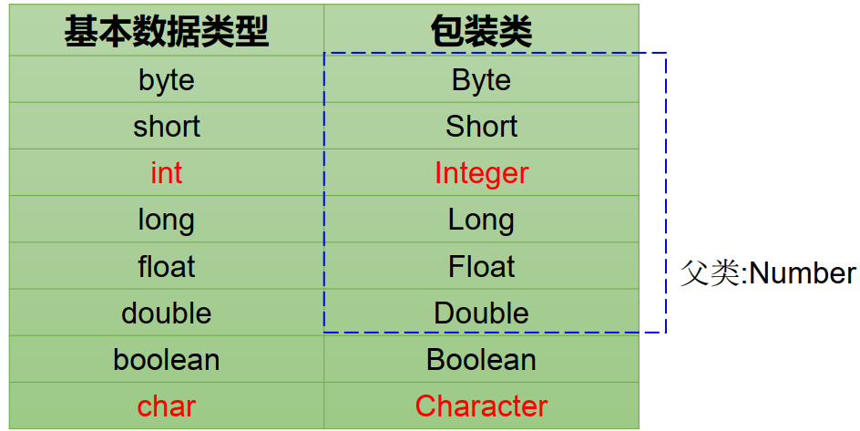
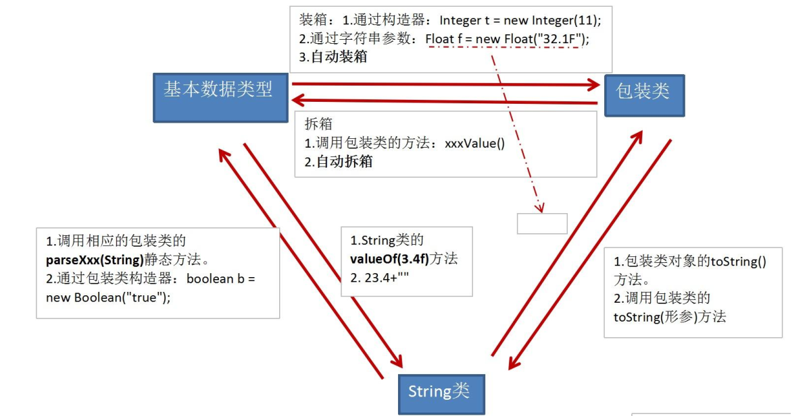

# [java]包装类的使用

### 包装类(Wrapper)的使用

- 针对八种基本数据类型定义相应的引用类型—包装类（封装类）  

- 有了类的特点，就可以调用类中的方法， Java才是真正的面向对象  

  


- 基本数据类型包装成包装类的实例（装箱）

  - 通过包装类的构造器实现

    ```java
    int i = 500;
    Integer t = new Integer(i);
    ```

  - 通过字符串参数构造包装类对象

    ```java
    Float f = new Float("4.56");
    Long l = new Long("asdf"); //NumberFormatException
    ```

- 获得包装类对象中包装的基本类型变量（拆箱）

  - 调用包装类的`.xxxValue()`方法

    ```java
    boolean b = bObj.booleanValue();
    ```

- JDK1.5之后，支持自动装箱，自动拆箱。但类型必须匹配。

  ```java
  int num = 10;
  method(num); // 会正常输出10，因为自动装箱拆箱
  
  public void method (Object obj){
      System.out.println(obj);
  }
  
  // 自动装箱: 基本数据类型 -> 包装类
  int num1 = 10;
  Integer int1 = num1;
  
  // 自动拆箱: 包装类 -> 基本数据类型
  System.out.println(int1。toString());
  int num2 = int1;
  ```

  

### 字符串转换成基本数据类型

- 通过包装类的构造器实现

  ```java
  int i = new Integer("12");
  ```

- 通过包装类的`parseXxx(String s)`静态方法

  ```java
  Float f = Float.parseFloat("12.1");
  ```

### 基本数据类型转换成字符串

- 调用字符串重载的`valueOf()`方法

  ```java
  String fstr = String.valueOf(2.34f);
  ```

- 更直接的方式

  ```java
  String intStr = 5 + ""
  ```

  

### 基本类型、包装类、String类之间的转换




### 例

```java
int i = 500;
Integer t = new Integer(i); // 装箱：包装类使得一个基本数据类型的数据变成了类。
// 有了类的特点，可以调用类中的方法。
String s = t.toString(); // s = “500“,t是类，有toString方法
String s1 = Integer.toString(314); // s1= “314“ 将数字转换成字符串。
String s2=“4.56”;
double ds=Double.parseDouble(s2); //将字符串转换成数字

// 拆箱：将数字包装类中内容变为基本数据类型。
int j = t.intValue(); // j = 500， intValue取出包装类中的数据

// 包装类在实际开发中用的最多的在于字符串变为基本数据类型。
String str1 = "30" ;
String str2 = "30.3" ;
int x = Integer.parseInt(str1) ; // 将字符串变为int型
float f = Float.parseFloat(str2) ; // 将字符串变为int型
```


### 面试题

```java
Object o1 = true ? new Integer(1) : new Double(2.0);// 三元运算符，两个要是同样的数据类型，Integer自动变为Double
System.out.println(o1);//1.0 

Object o2;
if (true)
    o2 = new Integer(1);
else
    o2 = new Double(2.0);
System.out.println(o2);//1
```

```java
Integer i = new Integer(1);
Integer j = new Integer(1);
System.out.println(i == j); // false - 
Integer m = 1;
Integer n = 1;
System.out.println(m == n);//true
Integer x = 128;//相当于new了一个Integer对象
Integer y = 128;//相当于new了一个Integer对象
System.out.println(x == y);//false - Integer内部定义了IntegerCache结构，IntegerCache中定义了Integer[]，保存了-128到127的整数。若使用自动装箱的方式，给Integer赋值的范围在-128~127范围内时，可以直接使用数组中的元素，不用再去new（目的：提高效率）。超出则用new新建一个Integer，此时x和y的地址不同
```

