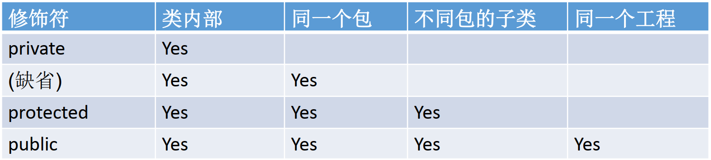

# [java]封装和隐藏

- 为何要封装？封装的作用/含义？
  - 我要用洗衣机，只需要按一下开关和洗涤模式就可以了。有必要了解洗衣机内部的结构吗？有必要碰电动机吗？  
- 程序设计追求“高内聚，低耦合”
  - 高内聚 ：类的内部数据操作细节自己完成，不允许外部干涉；
  - 低耦合 ： 仅对外暴露少量的方法用于使用。
- 隐藏对象内部的复杂性，只对外公开简单的接口。便于外界调用，从而提高系统的可扩展性、可维护性。通俗的说， **把该隐藏的隐藏起来，该暴露的暴露出来。 这就是封装性的设计思想**。  

### 信息的封装和隐藏

目的：

- 隐藏一个类中不需要对外提供的实现细节
- 使用者只能通过事先定制好的方法来访问数据， 可以方便地加入控制逻辑，
  限制对属性的不合理操作
- 便于修改， 增强代码的可维护性  

- e.g. 避免用户使用“对象.属性”的方式进行赋值
- e.g. 将属性似有话 (private)， 同时提供公共的(public)方法来获取(getXXX)和设置(setXXX)此属性的值。

### 权限修饰符

- 封装性的体现，需要权限修饰符来配合
  - Java的四种权限（从小到大排列）：private, 缺省(default), protected, public.

- 对于`class`的权限修饰只可以用`public`和`default`
- public类可以在任意地方被访问。
- default类只可以被同一个包内部的类访问。  