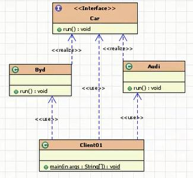
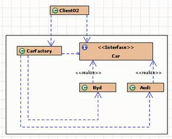
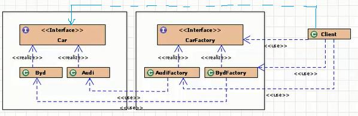

# [java]工厂设计模式

工厂模式： 实现了创建者与调用者的分离， 即将创建对象的具体过程屏蔽隔离起来，达到提高灵活性的目的。  

其实设计模式和面向对象设计原则都是为了使得开发项目更加容易扩展和维护，解决方式就是一个“分工”。  

### 一、 面向对象的设计原则  

（总共六个）：这里说几个和工厂模式相关的  

##### OCP（开闭原则， Open-Closed Principle）  

一个软件的实体应当对扩展开放，对修改关闭。  

当我们写完的代码，不能因为需求变化就修改。我们可以通过新增代码的方式来解决变化的需求。如果每次需求变动都去修改原有的代码，那原有的代码就存在被修改错误的风险，当然这其中存在有意和无意的修改，都会导致原有正常运行的功能失效的风险，这样很有可能会展开可怕的蝴蝶效应，使维护工作剧增。

说到底，开闭原则除了表面上的可扩展性强以外，在企业中更看重的是维护成本。  

所以，开闭原则是设计模式的第一大原则，它的潜台词是： *控制需求变动风险，缩小维护成本*。  

##### DIP（依赖倒转原则， Dependence Inversion Principle）  

要针对接口编程，不要针对实现编程。

如果 A 中关联 B，那么尽量使得 B 实现某个接口，然后 A 与接口发生关系，不与 B 实现类发生关联关系。

依赖倒置的潜台词是：面向抽象编程，解耦调用和被调用者。

##### LOD（迪米特法则， Law Of Demeter）  

只与你直接的朋友通信，而避免和陌生人通信。

要求尽量的封装，尽量的独立，尽量的使用低级别的访问修饰符。这是封装特性的典型体现。  

一个类如果暴露太多私用的方法和字段，会让调用者很茫然。并且会给类造成不必要的判断代码。所以，我们使用尽量低的访问修饰符，让外界不知道我们的内部。这也是面向对象的基本思路。这是迪米特原则的一个特性，无法了解类更多的私有信息。

另外，迪米特原则要求类之间的直接联系尽量的少，两个类的访问，通过第三个中介类来实现。

迪米特原则的潜台词是： 不和陌生人说话，有事去中介。

### 二、 工厂模式的分类：  

##### 简单工厂模式

用来生产同一等级结构中的任意产品。（对于增加新的产品，需要修改已有代码）

##### 工厂方法模式

用来生产同一等级结构中的固定产品。（支持增加任意产品）  

##### 抽象工厂模式

用来生产不同产品族的全部产品。（对于增加新的产品，无能为力；支持增加产品族）  

GOF 在《设计模式》一书中将工厂模式分为两类：工厂方法模式（Factory Method）与抽象工厂模式（Abstract Factory）。将简单工厂模式（Simple Factory）看为工厂方法模式的一种特例，两者归为一类。  

##### 核心本质

实例化对象，用工厂方法代替 new 操作。
将选择实现类、创建对象统一管理和控制。从而将调用者跟我们的实现类解耦。  


### 1、无工厂模式  

```java
package pattern.factory.nofactory;
interface Car{
    void run();
}
class Audi implements Car{
    public void run() {
        System.out.println("奥迪在跑");
    }
}
class BYD implements Car{
    public void run() {
        System.out.println("比亚迪在跑");
    }
}
public class Client01 {
    public static void main(String[] args) {
        Car a = new Audi();
        Car b = new BYD();
        a.run();
        b.run();
    }
}
```



### 2、简单工厂模式  

简单工厂模式， 从命名上就可以看出这个模式一定很简单。它存在的目的很简单：定义一个用于创建对象的工厂类。  

```java
interface Car {
    void run();
}
class Audi implements Car {
    public void run() {
        System.out.println("奥迪在跑");
    }
}
class BYD implements Car {
    public void run() {
        System.out.println("比亚迪在跑");
    }
}

//工厂类
class CarFactory {
    //方式一
    public static Car getCar(String type) {
        if ("奥迪".equals(type)) {
            return new Audi();
        } else if ("比亚迪".equals(type)) {
            return new BYD();
        } else {
            return null;
        }
    }
//方式二
// public static Car getAudi() {
// 		return new Audi();
// }
//
// public static Car getByd() {
// 		return new BYD();
// }
}
public class Client02 {
    public static void main(String[] args) {
        Car a = CarFactory.getCar("奥迪");
        a.run();
        Car b = CarFactory.getCar("比亚迪");
        b.run();
    }
}
```



调用者只要知道他要什么，从哪里拿，如何创建，不需要知道。分工，多出了一个专门生产 Car 的实现类对象的工厂类。 把调用者与创建者分离。

小结：
简单工厂模式也叫静态工厂模式，就是工厂类一般是使用静态方法，通过接收的参数的不同来返回不同的实例对象。
缺点： 对于增加新产品，不修改代码的话，是无法扩展的。 违反了开闭原则（ 对扩展开放；对修改封闭）。  

### 3、工厂方法模式  

为了避免简单工厂模式的缺点，不完全满足 OCP（对扩展开放，对修改关闭）。工厂方法模式和简单工厂模式最大的不同在于， 简单工厂模式只有一个（对于一个项目或者一个独立的模块而言）工厂类，而工厂方法模式有一组实现了相同接口的工厂类。 这样在简单工厂模式里集中在工厂方法上的压力可以由工厂方法模式里不同的工厂子类来分担。  

```java
interface Car{
    void run();
}
//两个实现类
class Audi implements Car{
    public void run() {
        System.out.println("奥迪在跑");
    }
}
class BYD implements Car{
    public void run() {
        System.out.println("比亚迪在跑");
    }
}
//工厂接口
interface Factory{
    Car getCar();
}
//两个工厂类
class AudiFactory implements Factory{
    public Audi getCar(){
        return new Audi();
    }
}
class BydFactory implements Factory{
    public BYD getCar(){
        return new BYD();
    }
}
public class Client {
    public static void main(String[] args) {
        Car a = new AudiFactory().getCar();
        Car b = new BydFactory().getCar();
        a.run();
        b.run();
    }
}
```



总结：
简单工厂模式与工厂方法模式真正的避免了代码的改动了？没有。在简单工厂模式中，新产品的加入要修改工厂角色中的判断语句；而在工厂方法模式中，要么将判断逻辑留在抽象工厂角色中，要么在客户程序中将具体工厂角色写死（就像上面的例子一样）。而且产品对象创建条件的改变必然会引起工厂角色的修改。面对这种情况， Java 的反射机制与配置文件的巧妙结合突破了限制——这在Spring 中完美的体现了出来。

### 4、 抽象工厂模式  

抽象工厂模式和工厂方法模式的区别就在于需要创建对象的复杂程度上。 而且抽象工厂模式是三个里面最为抽象、最具一般性的。抽象工厂模式的用意为：给客户端提供一个接口，可以创建多个产品族中的产品对象。而且使用抽象工厂模式还要满足一下条件：

- 系统中有多个产品族，而系统一次只可能消费其中一族产品。
- 同属于同一个产品族的产品以其使用。  