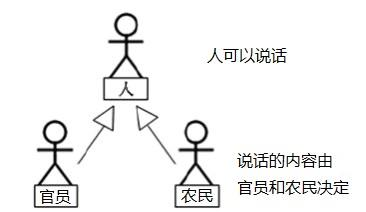
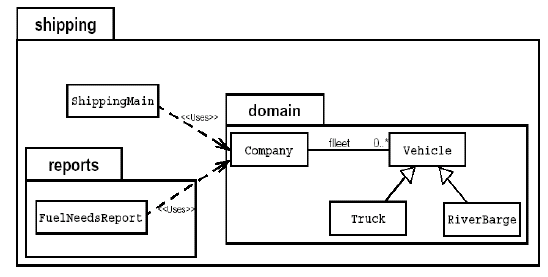

# [java]抽象类与抽象方法

随着继承层次中一个个新子类的定义，类变得越来越具体，而父类则更一般，更通用。类的设计应该保证父类和子类能够共享特征。有时将一个父类设计得非常抽象，以至于它没有具体的实例，这样的类叫做抽象类。  



### 概念

- 抽象类 - 用`abstract`关键字来修饰一个类
- 抽象方法 - 用`abstract`来修饰一个方法
  - 抽象方法：只有方法的声明，没有方法的实现。以分号结束：
  - 比如：`public abstract void talk();`
- 含有抽象方法的类必须被声明为抽象类。
- 抽象类不能被实例化。
  - 抽象类中一定有构造器，便于子类实例化时调用（涉及：子类对象实例化的全过程）
  - 开发中，都会提供抽象类的子类，让子类对象实例化，完后才能相关的操作。
  - 抽象类是用来被继承的，抽象类的子类必须重写父类的抽象方法，并提供方法体。
  - 若没有重写全部的抽象方法，仍为抽象类。
- 不能用`abstract`修饰变量、代码块、构造器；
- 不能用`abstract`修饰私有方法、静态方法、final的方法、final的类。


### 例

```java
abstract class A {
    abstract void m1();
    public void m2(){
        System.out.println("A类中定义的m2方法");
    }
}

class B extends A {
    void m1(){
        System.out.println("B类中定义的m1方法");
    }
}

public class Test {
    public static void main(String args[]){
        A a = new B();
        a.m1();
        a.m2();
    }
}
```


### 抽象类应用

抽象类是用来模型化那些父类无法确定全部实现，而是由其子类提供具体实现的对象的类。

例：在航运公司系统中，Vehicle类需要定义两个方法分别计算运输工具的燃料效率和行驶距离。



问题：卡车(Truck)和驳船(RiverBarge)的燃料效率和行驶距离的计算方法完全不同。Vehicle类不能提供计算方法，但子类可以。

```java
// 抽象类Vehicle
public abstract class Vehicle{
    public abstract double calcFuelEffiency(); //计算燃料效率的抽象方法
    public abstract double calcTripDistance(); //计算行驶距离的抽象方法
}

public class Truck extends Vehicle{
    public double calcFuelEffiency(){//计算卡车的燃料效率的具体方法}
    public double calcTripDistance(){//计算卡车行驶距离的具体方法}
}
        
public class RiverBarge extends Vehicle{
    public double calcFuelEffiency(){//计算卡车的燃料效率的具体方法}
    public double calcTripDistance(){//计算卡车行驶距离的具体方法}
}
```


### 思考

- 为什么抽象类不可以使用final关键字声明？
  - 抽象类都需要子类去继承，加了final无法继承。
- 一个抽象类中可以定义构造器吗？
  - 可以。子类需要用到抽象类中的构造器。
- 是否可以这样理解：抽象类就是比普通类多定义了抽象方法，除了不能直接进行类的实例化操作之外，并没有任何的不同？
  - 可以这么理解。

### 抽象类的匿名子类对象

```java
// Person extends Creature{}
Person p = new Person(){
    @Override
    public void eat() {
        System.out.println("吃");
    }
    
    @Override
    public void breath(){
        System.out.println("呼吸");
    }
}
```

