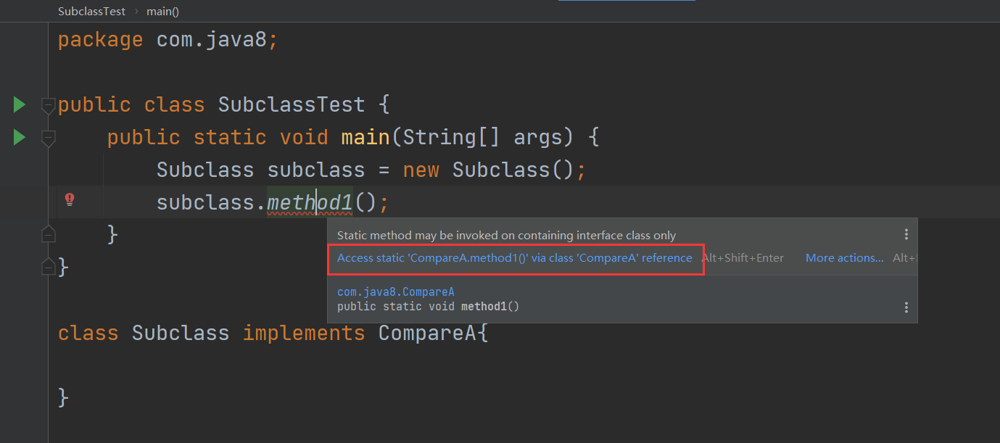

# [java]接口

### 概述

- 有时必须从几个类中派生出一个子类，继承它们所有的属性和方法。但是，Java不支持多重继承。有了接口，就可以得到多重继承的效果。
- 有时必须从几个类中抽取出一些共同的特征，而它们之间又没有is-a的关系，仅仅是具有相同的行为特征而已。例如：鼠标、键盘、打印机、扫描仪、摄像头、充电器、MP3、手机、数码相机、移动硬盘等都支持USB连接。
- 接口就是规范，定义的是一组规则，体现了现实世界中“如果你是/要…则必须能…的思想。
- 继承是一个“是不是”的关系，而接口是实现“能不能”的关系。
- 接口的本质是契约，标准，规范，就像法律一样。制定好后大家都要遵守。


### 接口的使用

- 接口使用`interface`来定义

- Java中，接口和类是并列的两个结构

  - 可以这么理解：接口是一种特殊的类。从本质上讲，接口是一种特殊的抽象类，这种抽象类中只包含常量和方法的定义(JDK7.0及以前)，而没有变量和方法的实现

- 如何定义接口，定义接口中的成员

  - JDK7及以前 - 只能够定义全局称量和抽象方法
    - 全局常量：`public static final`，代码中可省略这三个关键字
    - 抽象方法：`public abstract`
  - JDK8及以后 - 除了定义全局常量和抽象方法外，还可以定义静态方法、默认方法

  ```java
  interface Flyable{
      // 全局常量
      public static final int MAX_SPEED = 7900;
      int MIN_SPEED = 1;
  
      // 抽象方法
      public abstract void fly();
      void stop();
  }
  ```

- 接口中不能定义构造器！意味着接口不可以实例化

- Java开发中，接口通过类去实现(`implements`)的方式来使用

  - 如果实现类覆盖了接口中的所有抽象方法，则此实现类就可以实例化
  - 如果实现类没有覆盖接口中所有的抽象方法，则此实现类仍为抽象类

- Java类可以实现多个接口，弥补了Java单继承性的局限性

  有继承，有实现的语法：`class A extends B implements C,D,E{}`

```java
class Plane implements Flyable, Attackable{

    @Override
    public void fly() {
        
    }

    @Override
    public void stop() {

    }
}
```

- 接口与接口之间可以继承，而且可以多继承

  ```java
  interface A{
      
  }
  interface B{
      
  }
  
  interface C extends A,B{
      
  }
  ```

- 接口的具体使用，体现了多态性

  ```java
  public class InterfaceTest {
      public static void main(String[] args) {
          Computer computer = new Computer();
          Flash flash = new Flash();
          Printer printer = new Printer();
          computer.transferData(flash);
          computer.transferData(printer);
      }
  }
  
  class Computer{
      public void transferData(USB usb){
          usb.start();
          usb.stop();
      }
  }
  
  interface USB{
      void start();
      void stop();
  }
  
  class Flash implements USB{
  
      @Override
      public void start() {
  
      }
  
      @Override
      public void stop() {
  
      }
  }
  
  class Printer implements USB{
  
      @Override
      public void start() {
  
      }
  
      @Override
      public void stop() {
  
      }
  }
  ```

  ### 接口的匿名实现类的对象

  1. 创建接口的非匿名实现类的非匿名对象

     ```java
     Flash flash = new Flash();
     computer.transferData(flash);
     ```

  2. 创建接口的非匿名实现类的匿名对象

     ```java
     computer.transferData(new Printer());
     ```

  3. 创建接口的匿名实现类的非匿名对象

     ```java
     USB phone = new USB(){
         @Override
         public void start() {
     
         }
     
         @Override
         public void stop() {
     
         }
     };
     ```

  4. 创建接口的匿名实现类的匿名对象

     ```java
     computer.transferData(new USB(){
         @Override
         public void start() {
     
         }
     
         @Override
         public void stop() {
     
         }
     });
     ```

     

### 面试题：抽象类和接口有哪些异同？


### 面试题：排错

```java
interface A {
    int x = 0;
}
class B {
    int x = 1;
}
class C extends B implements A {
    public void pX() {
        System.out.println(x);//Error: The field x is ambiguous
        System.out.println(super.x);//1
        System.out.println(A.x);//0
    }
    public static void main(String[] args) {
        new C().pX();
    }
}
```

### 面试题：排错

```java
interface Playable {
    void play();
}
interface Bounceable {
    void play();
}
interface Rollable extends Playable,Bounceable {
    Ball ball = new Ball("PingPang"); // 这里省略了public static final
}

class Ball implements Rollable {
    private String name;
    public String getName() {
        return name;
    }
    public Ball(String name) {
        this.name = name;
    }
    public void play() {
        ball = new Ball("Football"); //这里应该是静态的，所以无法new
        System.out.println(ball.getName());
    }
}
```

### Java8中接口新特性

JDK8及以后 - 除了定义全局常量和抽象方法外，还可以定义静态方法、默认方法。从技术角度来说，这是完全合法的，只是它看起来违反了接口作为一个抽象定义的理念。  

**静态方法**： 使用 static 关键字修饰。 可以通过接口直接调用静态方法，并执行其方法体。我们经常在相互一起使用的类中使用静态方法。你可以在标准库中找到像Collection/Collections或者Path/Paths这样成对的接口和类。  

**默认方法**： 默认方法使用 default 关键字修饰。可以通过实现类对象来调用。我们在已有的接口中提供新方法的同时，还保持了与旧版本代码的兼容性。比如： java 8 API中对Collection、 List、Comparator等接口提供了丰富的默认方法。  

- 接口中定义的静态方法，只能通过接口来调用

  ```java
  // CompareA.java
  package com.java8;
  
  public interface CompareA {
      // 静态方法
      public static void method1(){
          System.out.println("CompareA:static");
      }
  
      // 默认方法
      public default void method2(){
          System.out.println("CompareA:default");
      }
  }
  
  // SubclassTest.java
  package com.java8;
  
  public class SubclassTest {
      public static void main(String[] args) {
          Subclass subclass = new Subclass();
          subclass.method1();//此处报错
      }
  }
  
  class Subclass implements CompareA{
  
  }
  ```

  

  应该这么写：

  ```java
  package com.java8;
  
  public class SubclassTest {
      public static void main(String[] args) {
          Subclass subclass = new Subclass();
          CompareA.method1();//直接用接口去调用接口中定义的静态方法
      }
  }
  
  class Subclass implements CompareA{
  
  }
  ```

- 通过实现类的对象，可以调用接口中的默认方法.

  - 若实现类重写了接口中的默认方法，调用时，调用的是重写之后的方法。

  ```java
  package com.java8;
  
  public class SubclassTest {
      public static void main(String[] args) {
          Subclass subclass = new Subclass();
          subclass.method2();
          subclass.method3();
      }
  }
  
  class Subclass implements CompareA{
  
  }
  ```

- 若子类（或实现类）继承的父类和实现的接口中声明了同名同参数的方法，那么子类在没有重写此方法的情况下，默认调用的是父类中同名同参数的方法。 –> 类优先原则

  ```java
  // Superclass.java
  public interface Superclass{
      default void method2(){
          System.out.println("Superclass:default")
      }
  }
  
  // SubclassTest.java
  package com.java8;
  
  public class SubclassTest {
      public static void main(String[] args) {
          Subclass subclass = new Subclass();
          subclass.method2(); // Superclass:default
      }
  }
  
  class Subclass extends Superclass implements CompareA{
  
  }
  
  
  ```

- 若实现类实现了多个接口，而这多个接口中定义了同名同参数的方法（不管此方法是否是默认方法）  ，那么在实现类没有重写此方法的情况下，报错。 –> 接口冲突。

  - 此时必须在实现类中重写此方法。

  ```java
  // CompareA和CompareB中都有method2()方法，同名同参数
  class Subclass extends Superclass implements CompareA,CompareB{
  	public void method2(){
          System.out.println("Subclass:default")
      }
  }
  ```

- 在实现类中调用各种类型的声明

  ```java
  class Subclass extends Superclass implements CompareA,CompareB{
      
      public void method2(){
          System.out.println("Subclass:default")
      }
      
  	public void myMethod(){
          method2(); //调用自己重写的方法
          super.method2(); //调用的是父类声明的方法
          //调用接口中的默认方法
          CompareA.super.method2(); //调用CompareA中声明的方法
          CompareB.super.method2(); //调用CompareB中声明的方法
      }
      
  }
  ```

  