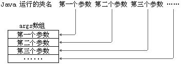

# [java]理解main方法的语法

- 由于Java虚拟机需要调用类的main()方法，所以该方法的访问权限必须是public。
- 又因为Java虚拟机在执行main()方法时不必创建对象，所以该方法必须是static的。
- 该方法接收一个String类型的数组参数，该数组中保存执行Java命令时传递给所运行的类的参数。 
- 每个类都可以有一个main方法。 
- 又因为main() 方法是静态的，我们不能直接访问该类中的非静态成员，必须创建该类的一个实例对象后，才能通过这个对象去访问类中的非静态成员，这种情况，我们在之前的例子中多次碰到。  

```java
public class MainTest{
    public static void main(String[] args){
        // 直接写show()不行，因为show()为非静态方法，静态方法main()只能调用静态的方法。此时会提示将show()方法变为static，但不能那么做
        show(); //报错
        // 需要先创建一个非静态的实例对象，再用这个非静态的实力对象去调用show()
        MainTest test = new MainTest();
        test.show();
    }
    
    public void show(){}
}
```


### 命令行参数用法举例  

```java
public class CommandPara {
    public static void main(String[] args) {
        for (int i = 0; i < args.length; i++) {
            System.out.println("args[" + i + "] = " + args[i]);
        }
    }
}

//运行程序CommandPara.java
java CommandPara “Tom" “Jerry" “Shkstart"
//输出结果：
args[0] = Tom
args[1] = Jerry
args[2] = Shkstart
```



### 面试题

```java
// 此处， Something类的文件名叫OtherThing.java
class Something {
    public static void main(String[] something_to_do) {
        System.out.println("Do something ...");
    }
}
```

上述程序是否可以正常编译、运行？  